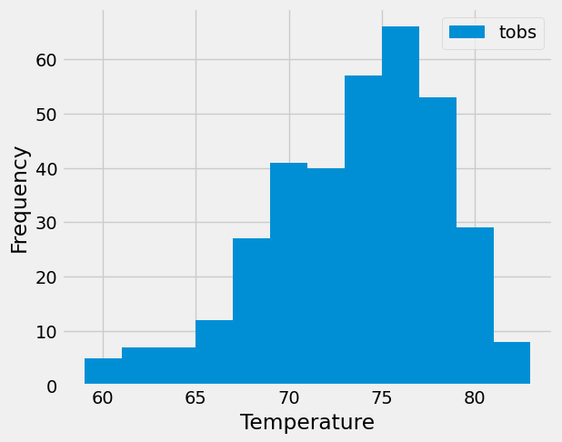

# sqlalchemy-challenge
Module 10 Challenge: I've decided to do a climate analysis about the area.
# Code Source
Python (app.py)  
Jupyter Notebook (climate.ipynb)  
DB Browser for SQLite (hawaii.sqlite)
## Part 1: Analyze and Explore the Climate Data
Using Python and SQLAlchemy to do basic climate analysis and data exploration of the climate database. (SQLAlchemy ORM queries, Pandas, and Matplolib)  

1. Using climate.ipynb and hawaii.sqlite to complete climate analysis and data exploration.  
2. Using SQLAlchemy create_engine() function to connect to SQLite database.  
3. Using SQLAlchemy automap_base() function to reflect tables into classes, and then save references to the classes named station and measurement.  
4. Linked Python to the database by creating a SQLAlchemy session.  
5. Performed a precipitation analysis and then a station analysis by completing the steps in the following two subsections.
### Precipitation Analysis
1. Found the most recent date in the dataset.  
2. Using the date, get the previous 12 months of precipitation data by quering the previous 12 months of data.  
3. Selected only the "date" and "prcp" values.  
4. Loaded the query results into a Pandas DataFrame. (Explicitly set the column names)  
5. Sort the DataFrame values by "date".  
6. Plotted the results by using the DataFrame plot method, as the following image shows:

7. Used Pandas to print the summary statistics for the precipiation data.
### Station Analysis
1. Designed a query to calculate the total number of stations in the dataset.  
2. Designed a query to find the most-activate stations (stations with most rows).  

- Listed the stations and observation counts in the descending order.  
- USC00519281 station id has the greatest number of observations.  

3. Designed a query that calculates the lowest, highest, and average temperatures that filters on the most-active station id found in the previous query.  
4. Designed a query to get the previous 12 months of temperature observations (TOBS) data.  

- Filtered by the station that has the greates number of observations.  
- Query the previous 12 months of TOBS data for that station.  
- Plotted the results as a histogram with bias=12.  

5. Closed session.
## Part 2: Design Your Climate App
Designed Flask API based on the queries developed in part 1.  
1. /  
- Start at the homepage.  
- List all the available routes.  
2. /api/v1.0/precipitation  
- Converted the query results from percipitation analysis to a dictionary using date as the key and prcp as the value.  
- Returned the JSON representation dictionary.  
3. /api/v1.0/stations  
- Returned a JSON list of stations from the dataset.  
4. /api/v1.0/tobs  
- Query the dates and temperature observations of the most-active station for the previous year of data.  
- Returned a JSON list of temperature obervations for the previous year.  
5. /api/v1.0/<\start>\ and /api/v1.0/<\start>\/<\end>\  
- Returned a JSON list of the minimum temperature, the average temperature, and the maximum temperature for a specified start or start-end range.  
- For a specified start, calculate TMIN, TAVG, and TMAX for all the dates greater than or equal to the start date.  
- For a specified start date and end date, calculate TMIN, TAVG, and TMAX for the dates from the start date to the end date, inclusive.
# References:
Menne, M.J., I. Durre, R.S. Vose, B.E. Gleason, and T.G. Houston, 2012: An overview of the Global Historical Climatology Network-Daily Database. Journal of Atmospheric and Oceanic Technology, 29, 897-910, https://journals.ametsoc.org/view/journals/atot/29/7/jtech-d-11-00103_1.xml  
Used google for .func, *sel, datetime.strptime, np.ravel, and timedelta, accessed March 2025.
